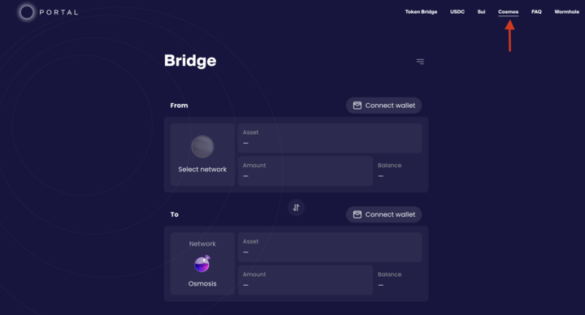
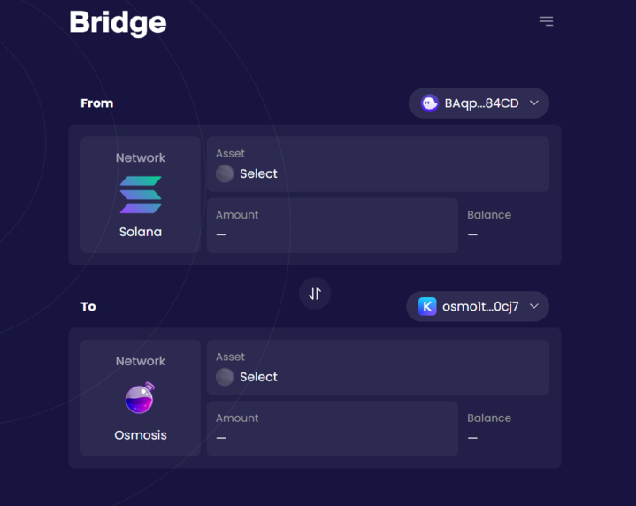
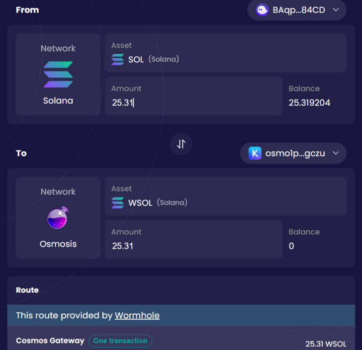
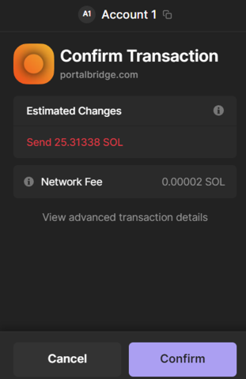
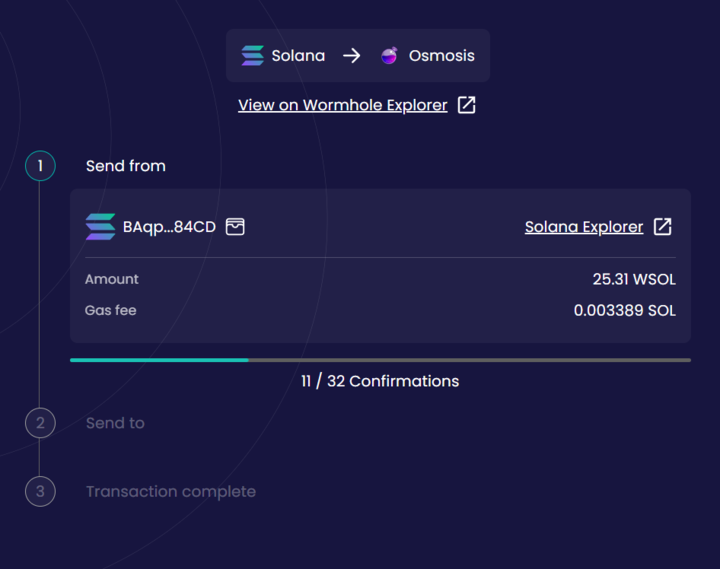
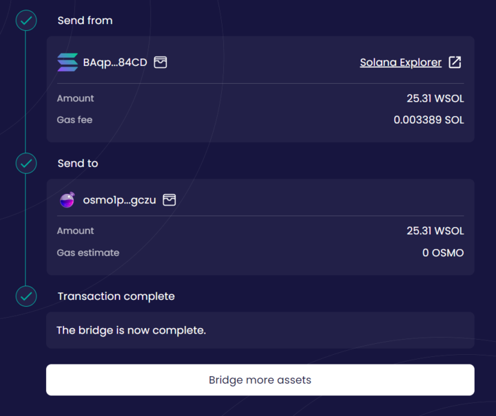

# How to Bridge to Osmosis

Token bridging to the Cosmos ecosystem is now live on Portal Bridge, powered by [Wormhole Gateway,](https://wormhole.com/gateway/) the Gateway to the Cosmos Ecosystem. The following is a short guide on how to bridge to [Osmosis](https://osmosis.zone/), the largest decentralized exchange appchain in the Cosmos ecosystem.

### Step 1: Visit Portal Bridge

Navigate to https://www.portalbridge.com/cosmos/. Ensure that the “Cosmos” subdomain is highlighted, as shown below. The Cosmos bridge is powered by [Wormhole Connect](https://wormhole.com/connect/).

### Step 2: Connect Wallets

Connect your relevant wallets for both the source and destination chains by clicking the “Connect Wallet” icons for both chains. In the example below, we’ll be bridging from Solana to Osmosis. The source chain wallet is Phantom Wallet, and the destination chain wallet is Keplr.

### Step 3: Select Asset Type and Quantity

Click on the asset you wish to send (in this case, SOL) and type in the quantity you’d like to transfer. At this point, you should see a depiction of the assets you’ll receive on the destination chain and the estimated cost to make the transfer. To proceed, click “Approve and proceed with transaction.”

### Step 4: Sign the Transaction

You will be prompted to sign a transaction from your source chain wallet to initiate the transfer. After reviewing the transaction, click “Confirm” to finalize the transaction.

### Step 5: Wait for Confirmation

Bridge transactions require a number of confirmations before being finalized on the recipient chain. The time required varies by chain, but for Solana this usually takes less than 30 seconds.

### Step 6: Transaction Complete

After all confirmations have been completed, the transaction is finalized. You will be able to see your assets in your Osmosis wallet by visiting https://app.osmosis.zone/assets. From here, you can add your assets to an Osmosis liquidity pool or swap them for another asset. Need further help? Visit us in discord at https://discord.com/invite/wormholecrypto

