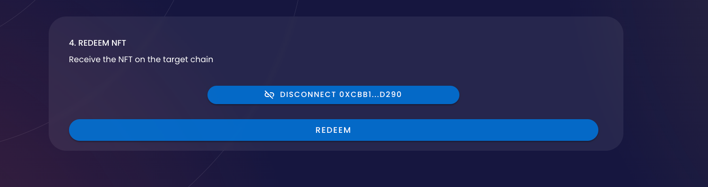

# NFT Portal

## Introduction

The NFT Portal allows users to send their NFT cross chain to Ethereum, Solana, BNB Chain, Polygon, Avalanche, Fantom, Oasis, Karura and Celo.&#x20;

The Wormhole NFT portal currently supports ERC-721 (with metadata) and SPL assets (with a supply of 1).&#x20;

To start, go to [https://portalbridge.com/#/nft](https://portalbridge.com/#/nft)

### 1. Source&#x20;

- Select the chain you want to send the NFT from
- Connect your wallet
- Select the NFT you want to send cross chain&#x20;
- Click "Next"

### 2. Target

- Select the chain you want to send the NFT to&#x20;
- Connect your wallet
- Click "Next"

### 3. Send NFT

- Click "Transfer"
- Accept wallet approval pop-up(s)
- Wait for the confirmation(s)

:::info
Once you approve the transfer, you must complete the transaction. If you navigate away from this page, you will need to complete the[ recovery workflow ](./how-to-use-recovery-workflow.md#redeem-workflow)
:::

### 4. Redeem NFT

- Click "Redeem"
- Accept wallet approval pop-up(s)

Now you've successfully transferred your NFT cross chain 🎉. \
For NFTs sent to Solana, it will be viewable under collectibles in your phantom wallet. \
For NFTs sent to Ethereum, these will be available to view in a marketplace such as Opensea.&#x20;

To see some of the NFTs sent to Ethereum, check out: [https://opensea.io/collection/wormhole-bridged-solana-nft](https://opensea.io/collection/wormhole-bridged-solana-nft)

